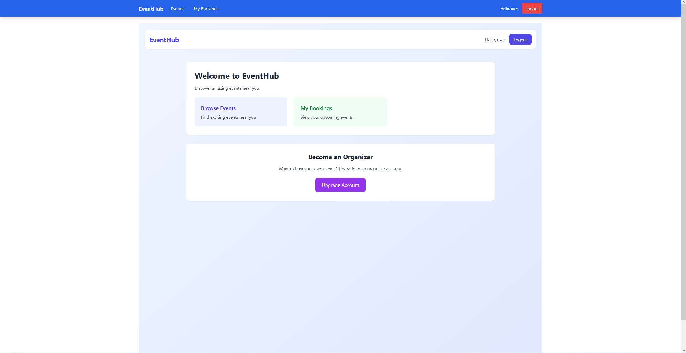
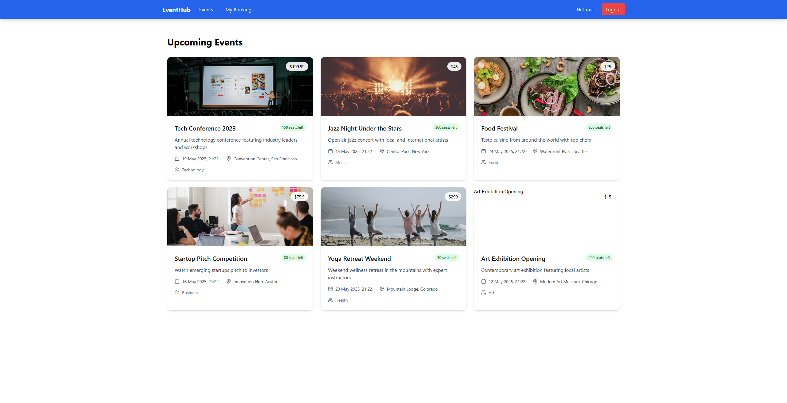
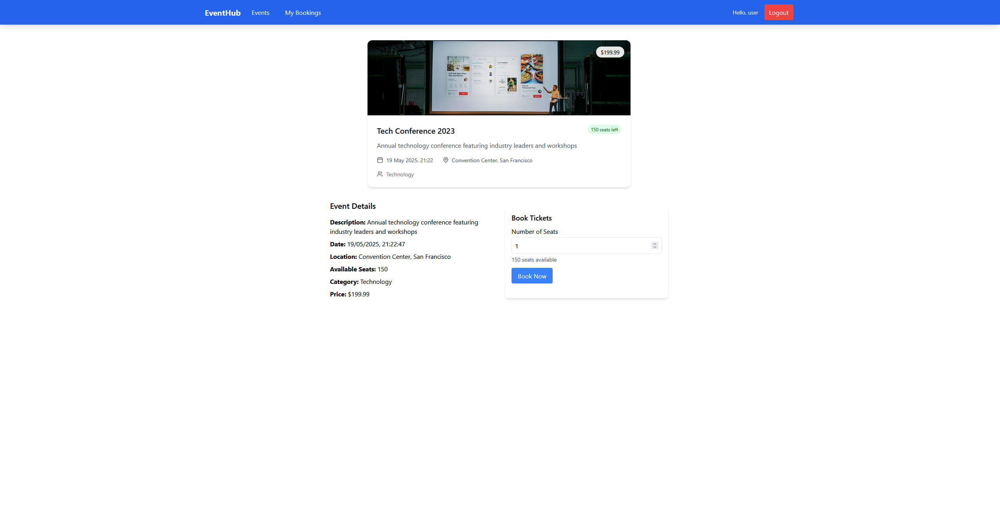
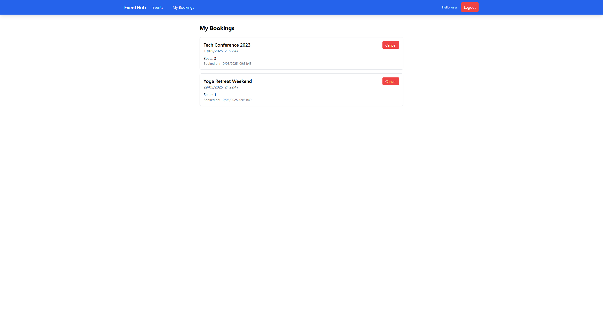

# EventHub


## Description du projet

EventHub est une application web de gestion d'événements et de réservations permettant aux utilisateurs de découvrir, créer et participer à des événements. Cette plateforme offre une interface intuitive pour les organisateurs d'événements et les participants, avec une gestion complète du cycle de vie des événements et des réservations.

### Fonctionnalités principales

- **Authentification** : Système complet d'inscription et de connexion sécurisée avec JWT
- **Gestion des événements** : Création, modification, suppression et consultation d'événements
- **Système de réservation** : Réservation et annulation de places pour les événements
- **Différents niveaux d'accès** : Utilisateurs standards et organisateurs d'événements
- **Interface responsive** : Expérience utilisateur optimisée sur tous les appareils

## Technologies utilisées

### Frontend
- React.js
- Tailwind CSS v3
- React Router
- Axios pour les appels API

### Backend
- Flask (Python)
- SQLite pour la base de données
- JWT pour l'authentification
- Flask-SQLAlchemy pour l'ORM

## Captures d'écran

### Page d'accueil


### Liste des événements


### Page détaillée d'un événement


### Page des réservations utilisateurs


## Installation et lancement

### Prérequis
- Node.js (v14+)
- Python (v3.8+)
- npm ou yarn

### Installation

1. **Cloner le dépôt**
   ```bash
   git clone https://github.com/HugoTheBeast/eventhub.git
   cd eventhub
   ```

2. **Configuration du Backend (Flask)**
   ```bash
   cd server
   
   # Créer un environnement virtuel
   python -m venv venv
   
   # Activer l'environnement virtuel
   # Sur Windows
   venv\Scripts\activate
   # Sur macOS/Linux
   source venv/bin/activate
   
   # Installer les dépendances
   pip install -r requirements.txt
   
   # Initialiser la base de données
   flask db init
   flask db migrate -m "Initial migration"
   flask db upgrade
   
   # Lancer le serveur backend
   flask run
   ```

3. **Configuration du Frontend (React)**
   ```bash
   cd ../client
   
   # Installer les dépendances
   npm install
   # ou
   yarn install
   
   # Lancer le serveur de développement
   npm start
   # ou
   yarn start
   ```

4. **Accéder à l'application**
   - L'application frontend sera disponible à l'adresse: `http://localhost:3000`
   - L'API backend sera disponible à l'adresse: `http://localhost:5000`

## Documentation de l'API

### Endpoints d'authentification

| Méthode | Endpoint | Description | Corps de la requête | Réponse |
|---------|----------|-------------|---------------------|---------|
| POST | `/api/auth/register` | Inscription d'un nouvel utilisateur | `{email, password, name, is_organizer}` | `{user_id, token}` |
| POST | `/api/auth/login` | Connexion utilisateur | `{email, password}` | `{user_id, token}` |
| GET | `/api/auth/me` | Récupérer les informations de l'utilisateur connecté | _Token JWT requis_ | `{user_id, email, name, is_organizer}` |

### Endpoints des événements

| Méthode | Endpoint | Description | Corps de la requête | Réponse |
|---------|----------|-------------|---------------------|---------|
| GET | `/api/events` | Récupérer tous les événements | _Filtres optionnels en query parameters_ | `[{event}]` |
| GET | `/api/events/{id}` | Récupérer un événement spécifique | - | `{event}` |
| POST | `/api/events` | Créer un nouvel événement (organisateurs uniquement) | `{title, description, date, location, max_seats, category_id}` | `{event_id}` |
| PUT | `/api/events/{id}` | Modifier un événement (créateur uniquement) | `{title, description, date, location, max_seats}` | `{event_id}` |
| DELETE | `/api/events/{id}` | Supprimer un événement (créateur uniquement) | - | `{success: true}` |

### Endpoints des réservations

| Méthode | Endpoint | Description | Corps de la requête | Réponse |
|---------|----------|-------------|---------------------|---------|
| POST | `/api/bookings` | Créer une nouvelle réservation | `{event_id, seat_count}` | `{booking_id}` |
| GET | `/api/bookings/my` | Récupérer les réservations de l'utilisateur connecté | _Token JWT requis_ | `[{booking}]` |
| DELETE | `/api/bookings/{id}` | Annuler une réservation | - | `{success: true}` |

## Structure du projet

```
eventhub/
├── client/                  # Frontend React
│   ├── public/
│   ├── src/
│   │   ├── components/      # Composants réutilisables
│   │   ├── pages/           # Pages de l'application
│   │   ├── services/        # Services pour les appels API
│   │   ├── contexts/        # Contextes React (auth, etc.)
│   │   └── App.js
│   └── package.json
│
├── server/                  # Backend Flask
│   ├── app.py               # Point d'entrée
│   ├── config.py            # Configuration
│   ├── models/              # Modèles de données
│   ├── routes/              # Routes API
│   └── requirements.txt
│
└── README.md                # Ce fichier
```

## Contributeurs

- Hugo Thessieu
- Sofiane Boujnane
- Sofiane Mohktari

## Licence

Ce projet est sous licence MIT.
